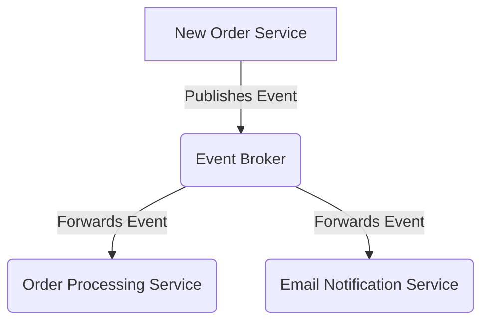

# 📨 Event-Driven Architecture: Local Event Grid Simulation

This project simulates **Azure Event Grid** on a **local machine** using Flask. It mimics the event-driven communication between microservices, including:

✅ **Event Broker** (Mimics Azure Event Grid)  
✅ **Order Processing Service** (Processes new orders)  
✅ **Email Notification Service** (Sends emails on new orders)

---

## ⚙️ **System Architecture**



- **Event Broker** (Acts as Azure Event Grid)
- **Subscribers (Event Handlers)**: Services that react to events
- **Event Publishing**: New orders trigger events

---

## 🚀 **Getting Started**

### 🔧 **1. Install Dependencies**

Run the following command to install required libraries:

```sh
pip install -r requirements.txt
```

(Not necessary anymore, taken care of in requirements.txt)

### 🎬 **2. Start All Services**

Run the script to launch the system:

```sh
bash run_all.sh
```

✅ **This will:**

- Start **Event Broker** on `http://localhost:5000`
- Start **Order Processor** on `http://localhost:5001`
- Start **Email Service** on `http://localhost:5002`
- Subscribe services to the broker
- Publish a **test order event**

---

## 📌 **How It Works**

### **1️⃣ Event Broker**

- Receives events from publishers
- Routes them to **subscribed** services

### **2️⃣ Order Processing Service**

- Listens for **NewOrder** events
- Processes the order

### **3️⃣ Email Notification Service**

- Listens for **NewOrder** events
- Sends a confirmation email

---

## 📤 **Publishing an Event Manually**

You can send a test event manually using `cURL`:

```sh
curl -X POST http://localhost:5000/publish \
     -H "Content-Type: application/json" \
     -d '{
          "eventType": "NewOrder",
          "data": {
            "orderId": "12345",
            "customerId": "67890",
            "orderValue": 150.0,
            "customerEmail": "customer@example.com"
          }
        }'
```

---

## 🛑 **Stopping Services**

To stop all running Flask apps, run:

```sh
bash stop_services.sh
```

This will **terminate all processes** running on ports `5000`, `5001`, and `5002`.

---

## 🛠 **File Structure**

```
📂 azure-eventgrid-mock/
│── 📜 README.md           # Project documentation
│── 📜 requirements.txt    # Required Python libraries
│── 📜 run_all.sh          # Startup script
│── 📜 stop_services.sh    # Stops all Flask services
│── 🚀 event_broker.py      # Core event broker (like Azure Event Grid)
│── 📦 order_processor.py   # Handles order processing
│── 📧 email_service.py     # Sends email notifications
│── 🛒 new_order_service.py # Publishes new orders to Event Grid
```

---

## 🔥 **Future Improvements**

🔹 Add **GUI Dashboard** to visualize events
🔹 Implement **Dead Letter Queue (DLQ)** for failed events
🔹 Add **Retry Mechanism** for undelivered events

---

## 🤝 **Contributing**

Contributions are welcome! Feel free to **fork**, submit PRs, or open issues.

---

## 📜 **License**

MIT License 📝

---
