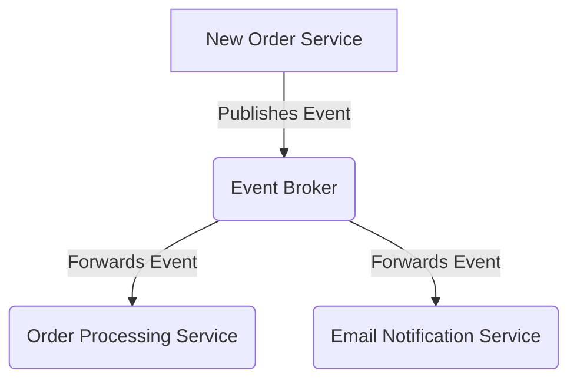

# 📨 Event-Driven Architecture: Local Event Grid Simulation

This project simulates **Azure Event Grid** on a **local machine** using Flask. It mimics the event-driven communication between microservices, including:

✅ **Event Broker** (Mimics Azure Event Grid)  
✅ **Order Processing Service** (Processes new orders)  
✅ **Email Notification Service** (Sends emails on new orders)

---

## ⚙️ **System Architecture**

